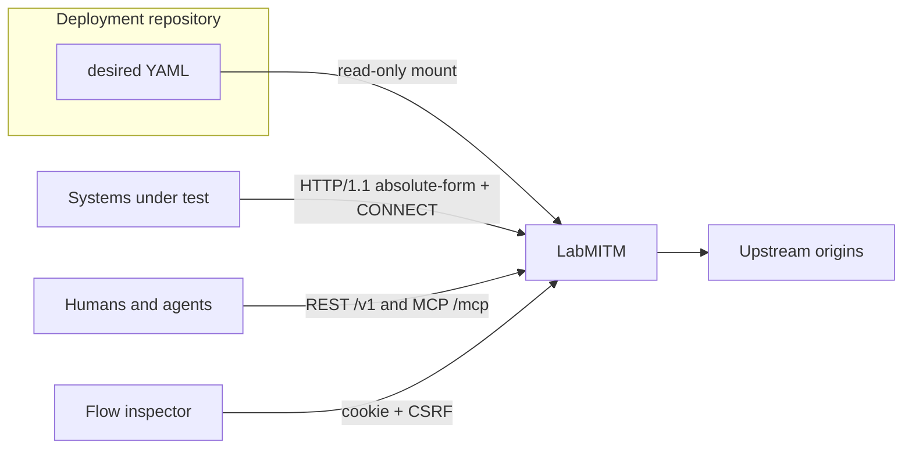

# LabMITM

**Laboratory HTTP(S) intercepting proxy.** Systems under test send HTTP/1.1
absolute-form requests and CONNECT tunnels here. LabMITM captures every
exchange, optionally decrypts TLS with a lab CA, and exposes the same
authorized operations over native REST `/v1`, MCP `POST /mcp`, and an
embedded flow inspector.

Desired state is one fail-closed `labmitm.dev/v1alpha1` YAML file. Captured
flows are ephemeral: restart or reset returns the process to the mounted
bootstrap and an empty store.

[](https://github.com/hilather/go-lab-mitmproxy/actions/workflows/ci.yml)
[](https://github.com/hilather/go-lab-mitmproxy/releases)
[](https://go.dev/dl/)
[](https://github.com/hilather/go-lab-mitmproxy/blob/main/LICENSE)

Status: **v1.2.0** · Module [`github.com/hilather/go-lab-mitmproxy`](https://github.com/hilather/go-lab-mitmproxy) · Binary `labmitm` · Image `ghcr.io/hilather/labmitm` · Schema `apiVersion: labmitm.dev/v1alpha1`, `kind: LabMITM`

New here? [START-HERE.md](https://github.com/hilather/go-lab-mitmproxy/blob/main/START-HERE.md). Architecture, ADRs, and the program board are in [Documentation](#documentation).

First-party HTTP(S) intercept appliance for [mcp-integration-lab](https://github.com/hilather/mcp-integration-lab). Family siblings: [LabDNS](https://github.com/hilather/go-lab-dns) · [LabMail](https://github.com/hilather/go-lab-maildev) · [LabLDAP](https://github.com/hilather/go-lab-ldap-mcp) · [TacLab](https://github.com/hilather/go-lab-tacacs-mcp).

LabMITM is a **lab appliance**, not a public edge proxy and not an attack
framework. It never wraps, vendors, or execs Python mitmproxy.

---

## Why LabMITM

Labs need a proxy they can **pin in YAML**, **inspect from an agent**, and
**reset**. LabMITM is that service:

| You need | LabMITM does |
|---|---|
| Capture HTTP from a system under test | HTTP/1.1 forward proxy: absolute-form + CONNECT |
| Read HTTPS bodies in the lab | In-process lab CA, per-host leaves, fail-closed intercept |
| Let an agent drive the appliance | One capability registry behind REST `/v1` and MCP `/mcp` |
| GitOps the lab | Read-only YAML bootstrap, revision-checked plan/apply, reset-to-file |
| Break a login path on purpose | Deterministic, default-off rules (delay, drop, status, header, body, breakpoint) |
| Look at a flow without curl | Embedded flow inspector at `/` |

It is not a public MITM product, a reverse proxy, or a fuzzer. Standalone
defaults bind loopback — an intercepting proxy on `0.0.0.0` is an open-proxy
loaded gun. The lab overlay publishes container ports.

| Plane | Standalone default | Lab / compose | Role |
|---|---|---|---|
| HTTP/1.1 forward proxy | `127.0.0.1:8888` | `:8888` (host `18888`) | absolute-form + CONNECT |
| Management / UI / REST / MCP | `127.0.0.1:8088` | `:8088` (host `18088`) | inspect and mutate |
| Metrics | `127.0.0.1:9090` | loopback-per-container | hand-rolled OpenMetrics |

Catalog id is **`labmitm`**. Overlay examples live in this repo
([`examples/labmitm.yaml`](https://github.com/hilather/go-lab-mitmproxy/blob/main/examples/labmitm.yaml),
MCPJungle JSON, labinfo snippet). `mcp-integration-lab` composes LabMITM
from vendor tag **v1.1.0** with image `labmitm:local`.

---

## Quick start

### 1. Build

```bash
git clone https://github.com/hilather/go-lab-mitmproxy.git
cd go-lab-mitmproxy
go version   # go1.26.x
go build -o bin/labmitm ./cmd/labmitm
./bin/labmitm version
```

Hardened image: non-root UID `65532`, scratch, read-only root, `cap_drop: ALL`,
system CA bundle copied so `x509.SystemCertPool()` is non-empty.

```bash
docker build -t ghcr.io/hilather/labmitm:local .
docker compose -f examples/compose.smoke.yaml up --build
```

### 2. Write bootstrap YAML

LabMITM loads **one** `labmitm.dev/v1alpha1` document. Unknown fields fail
closed. Secrets are file references only. Durations use Go syntax (`30s`,
`5m`); byte sizes use binary units (`10MiB`, `256KiB`). Bare numbers are
rejected.

Empty `spec: {}` is valid and materializes the standalone loopback defaults:

```yaml
apiVersion: labmitm.dev/v1alpha1
kind: LabMITM
metadata:
  name: lab-proxy
spec: {}
```

A management-ready bootstrap with TLS intercept and a bearer token:

```yaml
apiVersion: labmitm.dev/v1alpha1
kind: LabMITM
metadata:
  name: lab-proxy
spec:
  listeners:
    proxy:
      address: "127.0.0.1:8888"
    management:
      address: "127.0.0.1:8088"
      restPath: /v1
      mcpPath: /mcp
  tls:
    intercept: true
    ports: [443]
    ca:
      mode: generate
  management:
    auth:
      mode: bearer
      tokens:
        - id: admin
          secretFile: testdata/config/valid/admin.token
          role: administrator
          scopes: [mitm.read, mitm.write, mitm.admin, mitm.audit.read]
  ui:
    enabled: true
```

Fixtures:

- [`testdata/config/valid/defaults.yaml`](https://github.com/hilather/go-lab-mitmproxy/blob/main/testdata/config/valid/defaults.yaml) — empty spec, loopback defaults
- [`testdata/config/valid/explicit.yaml`](https://github.com/hilather/go-lab-mitmproxy/blob/main/testdata/config/valid/explicit.yaml) — fully materialized
- [`testdata/config/valid/rules-and-token.yaml`](https://github.com/hilather/go-lab-mitmproxy/blob/main/testdata/config/valid/rules-and-token.yaml) — rules + bearer
- [`examples/labmitm.yaml`](https://github.com/hilather/go-lab-mitmproxy/blob/main/examples/labmitm.yaml) — integration-lab overlay

Published schema: [`api/jsonschema/labmitm.dev.v1alpha1.json`](https://github.com/hilather/go-lab-mitmproxy/blob/main/api/jsonschema/labmitm.dev.v1alpha1.json).
Field rules: [docs/06-state-and-configuration.md](https://github.com/hilather/go-lab-mitmproxy/blob/main/docs/06-state-and-configuration.md).

### 3. Validate, canonicalize, serve

```bash
./bin/labmitm validate --config testdata/config/valid/defaults.yaml
# ok revision=sha256:…

./bin/labmitm canonicalize --config testdata/config/valid/defaults.yaml --format yaml
./bin/labmitm canonicalize --config testdata/config/valid/defaults.yaml --format json
```

`serve --management-listen` defaults to **off** (proxy only). Binding
management requires `spec.management.auth.mode: bearer` with at least one
usable token file.

```bash
# Proxy only — loopback, no management plane
./bin/labmitm serve \
  --config testdata/config/valid/defaults.yaml \
  --proxy-listen 127.0.0.1:8888 \
  --management-listen=off

# Proxy + REST / MCP / UI (needs a token file)
./bin/labmitm serve \
  --config testdata/config/valid/rules-and-token.yaml \
  --proxy-listen 127.0.0.1:8888 \
  --management-listen 127.0.0.1:8088
```

```bash
curl -x http://127.0.0.1:8888 -sS http://example.com/ -o /dev/null
TOKEN=$(head -1 testdata/config/valid/admin.token)
curl -sS -H "Authorization: Bearer $TOKEN" http://127.0.0.1:8088/v1/health/ready
# {"status":"ok"}
```

Useful flags: `--proxy-listen`, `--management-listen ADDR|off`,
`--shutdown-timeout` (default 5s), `--pid-file`.
`labmitm mcp-stdio --config … --token-file …` serves the same registry over
stdio. `labmitm healthcheck --url=http://127.0.0.1:8088/v1/health/ready`
probes readiness.

`tls.intercept: true` mints a lab CA and intercepts CONNECT on listed ports
(default `443`). Handshake failure does not fall back to a blind tunnel.
The CA certificate is `GET /v1/ca` (PEM cert only, authenticated; never the
key; not on `:8888`).

Open `http://127.0.0.1:8088/` for the flow inspector. Paste the bearer
token; the SPA talks REST only (`POST /v1/session`, cookie + CSRF).
`spec.ui.enabled: false` 404s `/` and keeps REST/MCP. Production UI assets:
`make web-build` (Node **22.14.0**).

---

## State loading APIs

Bootstrap YAML is **read-only**. The process never writes it. Runtime
changes live in memory until export or reset. The flow store is not YAML;
reset reloads the file **and** wipes flows.

```text
read file
  -> reject unknown fields and reserved names
  -> decode labmitm.dev/v1alpha1
  -> normalize names, durations, byte sizes, defaults
  -> validate cross-references and policy
  -> compile snapshot (rules index; CA generate or load)
  -> compute bootstrap + runtime revisions
  -> wipe configured spill path
  -> bind proxy, then management
```

Invalid bootstrap exits non-zero and binds nothing.

### CLI

| Command | What it loads |
|---|---|
| `labmitm validate --config PATH` | Decode, normalize, validate. Prints `sha256:` revision. |
| `labmitm canonicalize --config PATH [--format yaml\|json]` | Same, then emit canonical export (defaults materialized). |
| `labmitm serve --config PATH` | Compile, install bootstrap, bind proxy. Management only if `--management-listen` is an address. |
| `labmitm mcp-stdio --config PATH --token-file PATH` | Same snapshot, MCP over stdio. Token file required. |
| `labmitm healthcheck --url URL` | Probe `GET /v1/health/ready`. |
| `labmitm version` | Build info (not a state mutation). |

### REST (`/v1`)

Management is lab static bearer. Unauthenticated `GET /v1/flows` is 401.
OpenAPI: [`api/openapi/v1.json`](https://github.com/hilather/go-lab-mitmproxy/blob/main/api/openapi/v1.json).
Health live/ready skip auth.

**Inspect**

```bash
TOKEN=$(head -1 testdata/config/valid/admin.token)
AUTH=(-H "Authorization: Bearer $TOKEN")

curl -sS "${AUTH[@]}" http://127.0.0.1:8088/v1/health/ready
curl -sS "${AUTH[@]}" http://127.0.0.1:8088/v1/status          # listeners, store, intercept, CA (never the key)
curl -sS "${AUTH[@]}" http://127.0.0.1:8088/v1/state           # canonical + bootstrapRevision / runtimeRevision
curl -sS "${AUTH[@]}" http://127.0.0.1:8088/v1/schema/config   # published JSON Schema
curl -sS "${AUTH[@]}" "http://127.0.0.1:8088/v1/state:export?format=yaml"
```

`GET /v1/state` returns `bootstrapRevision`, `runtimeRevision`, `generation`,
`storeGeneration`, `drifted`, `flowCount`, and `canonical`. The response
header `X-LabMITM-Revision` is the runtime revision. Export YAML is the
file you commit back to Git.

**Validate a candidate without applying**

```bash
curl -sS -X POST "${AUTH[@]}" http://127.0.0.1:8088/v1/state:validate \
  -H 'Content-Type: application/json' \
  -d '{
    "operations": [
      {
        "op": "replaceRules",
        "rules": {
          "enabled": true,
          "items": [
            {
              "id": "drop-login",
              "enabled": true,
              "phase": "request",
              "match": { "pathPrefix": "/login", "method": "POST" },
              "action": { "type": "drop", "status": 403 }
            }
          ]
        }
      }
    ]
  }'
```

**Plan, apply, reset**

Writes require `expectedRevision` (body, `If-Match`, or
`X-LabMITM-Expected-Revision`). Optional `Idempotency-Key` /
`idempotencyKey` is retained in a 256-entry LRU.

```bash
REV=$(curl -sS "${AUTH[@]}" http://127.0.0.1:8088/v1/state | jq -r .runtimeRevision)

curl -sS -X POST "${AUTH[@]}" http://127.0.0.1:8088/v1/changes:plan \
  -H 'Content-Type: application/json' \
  -d "{\"expectedRevision\":\"$REV\",\"reason\":\"enable login breakpoint\",\"operations\":[{
        \"op\":\"replaceRules\",
        \"rules\":{\"enabled\":true,\"items\":[{
          \"id\":\"break-login\",
          \"enabled\":true,
          \"phase\":\"request\",
          \"match\":{\"pathPrefix\":\"/login\",\"method\":\"POST\"},
          \"action\":{\"type\":\"breakpoint\"}
        }]}
      }]}"

curl -sS -X POST "${AUTH[@]}" http://127.0.0.1:8088/v1/changes:apply \
  -H 'Content-Type: application/json' \
  -H 'Idempotency-Key: break-login-v1' \
  -d "{\"expectedRevision\":\"$REV\",\"reason\":\"enable login breakpoint\",\"operations\":[{
        \"op\":\"replaceRules\",
        \"rules\":{\"enabled\":true,\"items\":[{
          \"id\":\"break-login\",
          \"enabled\":true,
          \"phase\":\"request\",
          \"match\":{\"pathPrefix\":\"/login\",\"method\":\"POST\"},
          \"action\":{\"type\":\"breakpoint\"}
        }]}
      }]}"

curl -sS -X POST "${AUTH[@]}" http://127.0.0.1:8088/v1/state:reset \
  -H 'Content-Type: application/json' \
  -d '{"reason":"discard runtime drift"}'
```

Reset rereads the mounted bootstrap, compiles it, and swaps only on success.
A bad file leaves the live snapshot **and** the flow store untouched.

Live apply verbs (`replaceRules`, `replaceTLS`, `replaceAdmission`,
`replaceTargets`, `replaceStoreCaps`, `setFeature`, `replaceCompat`,
`replaceHTTPAuth`).
`protocols.http2`, `protocols.websocket` / `connect` / `absoluteForm`,
SOCKS accept, compat flow REST, `rules.enabled`, `ui.enabled`, and
opt-in HTTP proxy 407 (`spec.proxy.httpAuth`) are live without wiping
the inbox. Listener addresses and original-destination bind stay
bootstrap + **Reset** only.

### MCP (`POST /mcp`)

Same application layer as REST. Protocol **2026-07-28**. Manifest:
[`api/mcp/v1.json`](https://github.com/hilather/go-lab-mitmproxy/blob/main/api/mcp/v1.json).
Bearer only (same token set).

| Tool | REST twin |
|---|---|
| `mitm_state_get` | `GET /v1/state` |
| `mitm_state_validate` | `POST /v1/state:validate` |
| `mitm_change_plan` | `POST /v1/changes:plan` |
| `mitm_change_apply` | `POST /v1/changes:apply` |
| `mitm_state_export` | `GET /v1/state:export` |
| `mitm_state_reset` | `POST /v1/state:reset` |
| `mitm_schema_get` | `GET /v1/schema/config` |

Resources: `labmitm://state`, `labmitm://schema/config`, `labmitm://status`,
`labmitm://flows`, `labmitm://ca`. `subscriptions/listen` on
`labmitm://flows` notifies URI only; clients pull bodies with
`mitm_flows_list`.

Normative API docs: [docs/08-rest-api.md](https://github.com/hilather/go-lab-mitmproxy/blob/main/docs/08-rest-api.md),
[docs/09-mcp-api.md](https://github.com/hilather/go-lab-mitmproxy/blob/main/docs/09-mcp-api.md).

---

## How it fits together



The proxy loads one immutable compiled snapshot per request / CONNECT.
Mutations copy canonical state, apply typed operations, compile a candidate,
then atomically swap. In-flight sessions keep the pointer they loaded.

```text
accept
  -> admit and parse
  -> load one snapshot
  -> resolve-then-guard every A/AAAA
  -> CONNECT Hijack (or SOCKS, if enabled)
  -> optional TLS intercept
  -> first-match rules
  -> insert completed flow
```

---

## Capabilities

- **Proxy** — HTTP/1.1 absolute-form and CONNECT. Resolve-then-guard (deny
  cloud metadata and link-local by default; loopback allowed). Hop-by-hop
  strip. WebSocket 101 copy. `HTTP_PROXY` ignored.
- **TLS** — In-process lab CA (`generate` or files), per-host leaves,
  intercept ports (default `{443}`). Fail-closed: handshake failure stores
  an error and does not blind-tunnel. `GET /v1/ca` is cert-only.
- **Store** — Bounded ULID flow store (`maxFlows` / `maxBytes` /
  `maxBodyBytes`), wait, wipe, optional spill, breakpoint pause/resume/drop.
  Store-full still forwards.
- **Rules** — Deterministic first-match, default-off: delay, drop, status,
  header, body, breakpoint. No randomness.
- **Control** — REST + MCP parity from one registry. Optimistic concurrency,
  idempotency, audit ring, RBAC (`mitm.read` / `mitm.write` / `mitm.admin` /
  `mitm.audit.read`).
- **1.1 (opt-in; live `setFeature` except orig-dest bind)** — HTTP/2 on
  the inner hop, SOCKS5/4 multiplexed on the proxy listener, optional
  compat flow REST under `/compat`. Linux original-destination REDIRECT
  bind stays Reset-only. Hop gates `websocket` / `connect` /
  `absoluteForm` default **on** (D22 carve).
- **Ops** — Non-root scratch image, structured logs, versioned metrics
  catalog, compose smoke.

Known limits: [docs/known-limitations.md](https://github.com/hilather/go-lab-mitmproxy/blob/main/docs/known-limitations.md).

---

## Documentation

The numbered pack is the source of truth. Full catalog:
[docs/README.md](https://github.com/hilather/go-lab-mitmproxy/blob/main/docs/README.md).
Cross-file links below are absolute.

### Start here

| Path | Topic |
|---|---|
| [START-HERE.md](https://github.com/hilather/go-lab-mitmproxy/blob/main/START-HERE.md) | Onboarding and definition of done |
| [AGENTS.md](https://github.com/hilather/go-lab-mitmproxy/blob/main/AGENTS.md) | Contributor / agent rules |
| [docs/README.md](https://github.com/hilather/go-lab-mitmproxy/blob/main/docs/README.md) | Pack index |
| [CHANGELOG.md](https://github.com/hilather/go-lab-mitmproxy/blob/main/CHANGELOG.md) | Curated history |

### Architecture

| Path | Topic |
|---|---|
| [docs/01-architecture.md](https://github.com/hilather/go-lab-mitmproxy/blob/main/docs/01-architecture.md) | Process and package model |
| [docs/02-proxy-semantics.md](https://github.com/hilather/go-lab-mitmproxy/blob/main/docs/02-proxy-semantics.md) | Absolute-form, CONNECT, admission, target guards |
| [docs/03-tls-interception.md](https://github.com/hilather/go-lab-mitmproxy/blob/main/docs/03-tls-interception.md) | Lab CA, leaves, ALPN, upstream verify |
| [docs/04-flow-store.md](https://github.com/hilather/go-lab-mitmproxy/blob/main/docs/04-flow-store.md) | Caps, epoch, truncate, spill |
| [docs/05-rules.md](https://github.com/hilather/go-lab-mitmproxy/blob/main/docs/05-rules.md) | Deterministic rules, breakpoint, replay |
| [docs/06-state-and-configuration.md](https://github.com/hilather/go-lab-mitmproxy/blob/main/docs/06-state-and-configuration.md) | YAML, revisions, reset |
| [docs/07-control-plane-and-parity.md](https://github.com/hilather/go-lab-mitmproxy/blob/main/docs/07-control-plane-and-parity.md) | Capability registry |

### Interfaces

| Path | Topic |
|---|---|
| [docs/08-rest-api.md](https://github.com/hilather/go-lab-mitmproxy/blob/main/docs/08-rest-api.md) | Native `/v1` |
| [docs/09-mcp-api.md](https://github.com/hilather/go-lab-mitmproxy/blob/main/docs/09-mcp-api.md) | MCP tools and resources |
| [docs/11-observability.md](https://github.com/hilather/go-lab-mitmproxy/blob/main/docs/11-observability.md) | Logs, metrics, probes |

### Security, operations, release

| Path | Topic |
|---|---|
| [docs/10-security-architecture.md](https://github.com/hilather/go-lab-mitmproxy/blob/main/docs/10-security-architecture.md) | Threat model, CA, Dial isolation |
| [docs/12-testing-strategy.md](https://github.com/hilather/go-lab-mitmproxy/blob/main/docs/12-testing-strategy.md) | Test layers |
| [docs/13-deployment.md](https://github.com/hilather/go-lab-mitmproxy/blob/main/docs/13-deployment.md) | Image, compose, CLI |
| [docs/14-integration-lab.md](https://github.com/hilather/go-lab-mitmproxy/blob/main/docs/14-integration-lab.md) | Overlay BOM for mcp-integration-lab |
| [docs/known-limitations.md](https://github.com/hilather/go-lab-mitmproxy/blob/main/docs/known-limitations.md) | 1.0 defaults + 1.2 residuals |
| [docs/releases/v1.5.0.md](https://github.com/hilather/go-lab-mitmproxy/blob/main/docs/releases/v1.5.0.md) | 1.5.0 tag notes (operator SPA split-pane + leftover Login/Status/Audit/Reset chrome) |
| [docs/releases/v1.4.0.md](https://github.com/hilather/go-lab-mitmproxy/blob/main/docs/releases/v1.4.0.md) | 1.4.0 tag notes (issue #52 QA knobs) |
| [docs/releases/v1.3.0.md](https://github.com/hilather/go-lab-mitmproxy/blob/main/docs/releases/v1.3.0.md) | 1.3.0 tag notes (live hop/protocol gates) |
| [docs/releases/v1.2.0.md](https://github.com/hilather/go-lab-mitmproxy/blob/main/docs/releases/v1.2.0.md) | 1.2.0 tag notes |
| [docs/releases/v1.1.1.md](https://github.com/hilather/go-lab-mitmproxy/blob/main/docs/releases/v1.1.1.md) | 1.1.1 tag notes |
| [docs/releases/v1.1.0.md](https://github.com/hilather/go-lab-mitmproxy/blob/main/docs/releases/v1.1.0.md) | 1.1.0 tag notes |
| [docs/releases/v1.0.0-rc.1.md](https://github.com/hilather/go-lab-mitmproxy/blob/main/docs/releases/v1.0.0-rc.1.md) | Untagged 1.0 candidate notes |

### Architecture decisions

- [0001 Use Go](https://github.com/hilather/go-lab-mitmproxy/blob/main/docs/adr/0001-use-go.md)
- [0002 In-tree HTTP/1.1 forward proxy](https://github.com/hilather/go-lab-mitmproxy/blob/main/docs/adr/0002-in-tree-http-forward-proxy.md)
- [0003 Ephemeral flows and GitOps](https://github.com/hilather/go-lab-mitmproxy/blob/main/docs/adr/0003-ephemeral-flows-and-gitops.md)
- [0004 Shared capability registry](https://github.com/hilather/go-lab-mitmproxy/blob/main/docs/adr/0004-shared-capability-registry.md)
- [0005 Lab static bearer](https://github.com/hilather/go-lab-mitmproxy/blob/main/docs/adr/0005-lab-static-bearer.md)
- [0006 Pin MCP protocol versions](https://github.com/hilather/go-lab-mitmproxy/blob/main/docs/adr/0006-pin-mcp-protocol-versions.md)
- [0007 No mitmproxy compat surface](https://github.com/hilather/go-lab-mitmproxy/blob/main/docs/adr/0007-no-mitmproxy-compat-surface.md)
- [0008 Additive v1alpha1 1.1 fields](https://github.com/hilather/go-lab-mitmproxy/blob/main/docs/adr/0008-additive-v1alpha1-11.md)
- [0009 HTTP/2 via http2x](https://github.com/hilather/go-lab-mitmproxy/blob/main/docs/adr/0009-http2-via-http2x.md)
- [0010 SOCKS and original destination](https://github.com/hilather/go-lab-mitmproxy/blob/main/docs/adr/0010-socks-and-original-destination.md)
- [0011 Optional compat flow REST](https://github.com/hilather/go-lab-mitmproxy/blob/main/docs/adr/0011-optional-compat-flow-rest.md)
- [0012 1.2 protocol expansion](https://github.com/hilather/go-lab-mitmproxy/blob/main/docs/adr/0012-protocol-expansion-12.md)
- [0013 Live protocol feature gates](https://github.com/hilather/go-lab-mitmproxy/blob/main/docs/adr/0013-live-protocol-feature-gates.md)
- [0014 QA block modes](https://github.com/hilather/go-lab-mitmproxy/blob/main/docs/adr/0014-qa-block-modes.md)
- [0015 WebSocket frame rules](https://github.com/hilather/go-lab-mitmproxy/blob/main/docs/adr/0015-websocket-frame-rules.md)
- [0016 Rules throttle action](https://github.com/hilather/go-lab-mitmproxy/blob/main/docs/adr/0016-rules-throttle-action.md)
- [0017 HTTP proxy 407](https://github.com/hilather/go-lab-mitmproxy/blob/main/docs/adr/0017-http-proxy-407.md)

### Task lists and program board

Implementation contracts (not a substitute for the design docs):

- [tasks/README.md](https://github.com/hilather/go-lab-mitmproxy/blob/main/tasks/README.md) — how to take a task
- [tasks/00-program-board.md](https://github.com/hilather/go-lab-mitmproxy/blob/main/tasks/00-program-board.md) — PRs 1–14, milestones, frozen decisions

### Generated contracts and examples

- [`api/capabilities/v1.json`](https://github.com/hilather/go-lab-mitmproxy/blob/main/api/capabilities/v1.json) · [`api/openapi/v1.json`](https://github.com/hilather/go-lab-mitmproxy/blob/main/api/openapi/v1.json) · [`api/mcp/v1.json`](https://github.com/hilather/go-lab-mitmproxy/blob/main/api/mcp/v1.json)
- [`api/metrics/v1alpha1.json`](https://github.com/hilather/go-lab-mitmproxy/blob/main/api/metrics/v1alpha1.json) · [`api/jsonschema/labmitm.dev.v1alpha1.json`](https://github.com/hilather/go-lab-mitmproxy/blob/main/api/jsonschema/labmitm.dev.v1alpha1.json)
- [`examples/labmitm.yaml`](https://github.com/hilather/go-lab-mitmproxy/blob/main/examples/labmitm.yaml) · [`examples/compose.smoke.yaml`](https://github.com/hilather/go-lab-mitmproxy/blob/main/examples/compose.smoke.yaml) · [`examples/compose.originaldest.yaml`](https://github.com/hilather/go-lab-mitmproxy/blob/main/examples/compose.originaldest.yaml)
- [`examples/compat/flow-rest-contract.md`](https://github.com/hilather/go-lab-mitmproxy/blob/main/examples/compat/flow-rest-contract.md)

---

## Build and test

Toolchain: **Go 1.26** (`go1.26.x`). Operator console: **Node 22.14.0**.

```text
make format
make lint
make generate
make verify-generated
make test
make test-race
make test-fuzz-smoke
make test-parity
make test-config-compat
make test-docs
make test-container
make security-scan
make test-changelog
make web-test
make web-build
make build
```

Required CI jobs (no bypass): format, lint, unit, race, fuzz-smoke,
generated-file, documentation, security-scan, changelog, parity,
config-compat, container-test, web. Tag creation is gated by
`.github/workflows/release.yml` (`tag-gate`). `make test-container` needs
Docker. Soak: `go test ./internal/perf` (CI N=8).

---

## License

[Apache License 2.0](https://github.com/hilather/go-lab-mitmproxy/blob/main/LICENSE)
