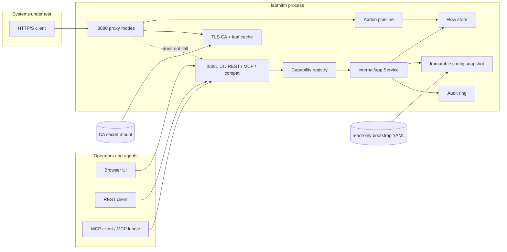

# System Architecture

Status: Proposed normative behavior
Owners: Architecture, Proxy, Control Plane
Last reviewed: 2026-08-18 (design pack)
Related ADRs: 0001–0012

## Problem statement

`mcp-integration-lab` publishes real network protocols and drives them from one MCP gateway. It does not yet include an intercepting HTTP(S) proxy. Off-the-shelf [mitmproxy](https://github.com/mitmproxy/mitmproxy) is the feature reference, but it is a Python process with a Tornado mitmweb API, no family YAML desired state, no capability registry, and no MCP surface. Wrapping it would fight the lab’s Go-appliance model (LabDNS, LabLDAP, TacLab, LabMail).

**LabMITM** is a single-process Go lab appliance in that family. Systems under test send HTTP, HTTPS, WebSocket, and (in 1.1) HTTP/3 traffic through it. LabMITM intercepts TLS with a mounted lab CA, records flows, allows intercept/resume/modify/replay, and exposes **every public control** on both native REST `/v1` and MCP. A mitmweb-compatible adapter preserves existing REST clients. Captured flows are ephemeral. Desired state is a fail-closed `labmitm.dev/v1alpha1` YAML file.

This is an **independent rewrite** (ADR 0010). Feature parity means the frozen 1.0 inventory in this pack, not a line-by-line Python port.

## Naming and artifacts

| Kind | Value |
|---|---|
| Product | LabMITM |
| Repository | `github.com/hilather/go-lab-mitmproxy` |
| Go module | `github.com/hilather/go-lab-mitmproxy` |
| Binary / CLI | `labmitm` |
| Image | `ghcr.io/hilather/labmitm` (`:local` for compose builds, digest-pin in GitOps) |
| Container user | `65532:65532` |
| Config schema | `labmitm.dev/v1alpha1` |
| Kind | `LabMITM` |
| Native REST | `/v1` |
| MCP | `POST /mcp` (Streamable HTTP, stateless) |
| Compat REST | mitmweb paths (`/flows`, `/options`, `/commands`, `/updates`, …) |
| UI | `/` (SPA) |
| Metrics | Hand-rolled OpenMetrics; default `127.0.0.1:9090`; `/v1/metrics` only if `publicPath: true` |
| Error URN prefix | `urn:labmitm:error:` |
| MCP resource URI | `labmitm://...` |
| Default proxy bind | `:8080` |
| Default management bind | `:8081` |
| Lab host ports | `18880` (proxy), `18081` (management), optional `11080` (SOCKS) |
| Healthcheck | `labmitm healthcheck --url=http://127.0.0.1:8081/v1/health/ready` |
| labinfo catalog id | `labmitm` |
| MCP tools | `mitm_*` (frozen) |

## Goals (1.0)

1. Single-process Go appliance that intercepts HTTP/1.1, HTTP/2, and WebSockets with on-the-fly TLS.
2. Versioned, fail-closed YAML bootstrap; runtime flows ephemeral; reset rereads bootstrap and wipes flows (CA secret remains).
3. Same authorized flow and state operations on REST and MCP (parity). No public REST control without an MCP twin except `REST_ONLY_PROTOCOL`.
4. mitmweb REST compat adapter so existing `/flows` clients survive.
5. Embedded operator UI that calls native REST only.
6. Hardened container: non-root UID 65532, scratch/static, read-only root, `cap_drop: ALL`, no-new-privileges, tmpfs `/tmp`.
7. In-tree proxy core (regular, reverse, SOCKS5, upstream) with an explicit accept/reject and mode table.
8. Bounded flow store (count + bytes) with a fail-closed full policy.
9. Built-in transforms matching mitmproxy: `modify_headers`, `modify_body`, `map_local`, `map_remote`, `block_list`, `anticache`, `anticomp`, sticky cookie/auth, intercept.
10. Starlark addon scripts with a documented hook set (not CPython).
11. Structured errors, audit, metrics, live/ready probes.
12. Design-pack-first repo: this pack, ADRs, generated contracts, and a task/PR plan before (and with) code.

## Non-goals (1.0)

- Embedding or exec’ing Python mitmproxy / mitmdump / mitmweb.
- CPython addon compatibility (`scripts:` pointing at `.py` files). 1.1 may add an out-of-process bridge under a new ADR.
- Console TUI (`mitmproxy` urwid). Operators use the SPA, REST, MCP, or `labmitm dump`.
- Transparent, TUN, WireGuard, and local-capture modes in the default image (need extra capabilities / host net). 1.1: [ADR 0009](adr/0009-privileged-modes-deferred.md).
- HTTP/3 and raw QUIC in 1.0 ([ADR 0011](adr/0011-http2-now-http3-later.md)).
- DNS proxy mode that replaces LabDNS. Optional 1.1 DNS reverse/forward helper is out of 1.0.
- ASGI in-process apps, `browser` launcher, process-list local-capture UI.
- Writing the bootstrap YAML (`options.save` that persists to the mount is 403 unless an explicit future ADR).
- Being a production CDN, WAF, or legally privileged intercept platform.
- Open proxy defaults (`ssl_insecure: true`, unauthenticated management) as image defaults.
- Multi-replica shared flow store or consensus.
- OAuth Protected Resource Metadata (family exemption: lab static bearer).

## Key decisions

These are closed. Implementers do not re-litigate them without an ADR.

| ID | Decision | Rationale |
|---|---|---|
| **D1** | **Product name is LabMITM.** Repo remains `go-lab-mitmproxy`. Module `github.com/hilather/go-lab-mitmproxy`. Binary `labmitm`. Image `ghcr.io/hilather/labmitm`. YAML `apiVersion: labmitm.dev/v1alpha1`, `kind: LabMITM`. | Follow LabDNS / LabMail naming. |
| **D2** | **Single process, two planes.** Proxy data plane is independent of management HTTP. One binary, one container. | LabDNS / LabMail process model. Proxy must keep accepting if REST/MCP is slow or unbound (`--management-listen=off`). |
| **D3** | **Desired state is YAML; flows are not.** Config revision is a content hash of canonical spec. Flow store has its own monotonic `storeGeneration`. Reset reloads YAML **and** wipes flows. | Family GitOps invariant. Captured traffic is runtime evidence. |
| **D4** | **REST and MCP share one capability registry.** Adapters never call each other and never contain proxy/store business logic. | LabDNS ADR 0004. mitmweb having no MCP is the gap this product closes. |
| **D5** | **Native management API is `/v1` + `POST /mcp`.** mitmweb routes are a **compat adapter** (`REST_ONLY_PROTOCOL` plus parity-required native twins). | Compat exists so existing mitmweb REST scripts can be pointed at LabMITM. |
| **D6** | **Auth: lab static bearer is primary.** Optional HTTP Basic maps onto the same principal. MCP is bearer-only. No OAuth PRM. | Family lab tokens. mitmweb `web_password` becomes the bearer/basic secret. |
| **D7** | **In-tree proxy core.** CONNECT, HTTP/1 session, TLS interception, flow lifecycle owned in `internal/proxy`. Use `golang.org/x/net/http2` behind an adapter. Do not vendor goproxy/martian/mitmproxy. | Family owns protocol state machines. |
| **D8** | **1.0 modes: `regular`, `reverse`, `socks5`, `upstream`.** Multiple modes may bind (mitmproxy `mode` is a sequence). Privileged modes are 1.1. | Lab compose cannot grant `NET_ADMIN` in the default hardened image. |
| **D9** | **HTTP/2 and WebSocket in 1.0. HTTP/3 in 1.1.** | HTTP/3 pulls `quic-go` and UDP listeners; schedule as H3-001. |
| **D10** | **CA is a mounted secret.** Generate at `mcplab secrets` (or `labmitm ca generate` for standalone). Never regenerate a live CA on restart if files exist. Missing CA fail-closes serve. | Clients trust a stable lab CA. |
| **D11** | **Starlark, not CPython, for 1.0 scripts.** Hook names mirror mitmproxy’s documented addon events where they map cleanly. | Scratch image, no interpreter, sandbox. |
| **D12** | **Embedded UI ships in 1.0.** React/TS + Vite (Node **22.14.0**), TacLab/LabMail pattern. Calls generated REST only. | Replacement for mitmweb UI. |
| **D13** | **Container ports stay 8080 (proxy) / 8081 (management).** Host ports in the lab are 18880 / 18081. | Avoid LabDNS host 18080, gateway 8080, LabMail 1080. |
| **D14** | **Go 1.26, official MCP SDK `v1.7.0`, protocol `2026-07-28`, Apache-2.0.** `gopkg.in/yaml.v3` with `KnownFields(true)`. | Family pins. |
| **D15** | **`spec.management.mcp.allowLegacyClients` default false; integration-lab overlay sets true.** `subscriptions/listen` stays pinned to 2026-07-28. | TacLab/LabMail knob so MCPJungle can register without a LabMITM patch. |
| **D16** | **`block_global` default false in lab overlay; schema default true (mitmproxy-compatible) is overridden by the lab example.** | Published lab clients are not loopback. |
| **D17** | **Filter language is mitmproxy-compatible with RE2.** Python-regex-only features are documented residuals. | Go `regexp` is RE2. |
| **D18** | **Native dump is `labmitm dump v1` (JSONL) plus HAR 1.2.** Writing identical mitmproxy pickle/tnetstring dumps is not 1.0. | Independent rewrite; HAR is the portable interop. |

## Process architecture

One `labmitm` process. Invalid bootstrap does **not** bind proxy or management (LabDNS rule). Missing CA files do **not** bind the proxy.



```text
Client
  -> mode listener (regular CONNECT / reverse / socks5 / upstream)
  -> admission (conns, rate, body size)
  -> TLS intercept (optional, per host allow/ignore)
  -> HTTP/1 or HTTP/2 codec
  -> addon pipeline (built-in + Starlark)
  -> intercept gate (hold / resume / kill)
  -> upstream (unless map_local / server replay / block)
  -> store.Insert / update
  -> metrics + optional audit

REST adapter ----+
MCP adapter -----+--> capabilities registry --> app.Service
Compat adapter --+                              -> store / snapshot / replay / audit
UI (static) -----> REST only
```

**Invariant:** `internal/proxy` must not import `internal/control` (including `internal/control/mcp` and `internal/control/rest`), `internal/web`, or management `net/http` servers. Management failure must not stop the proxy. The proxy must not block on MCP clients.

## Embedded operator UI

Required for GA / 1.0 (D12, UI-001). The UI talks REST only.

| Item | Choice |
|---|---|
| Stack | React + TypeScript + Vite (Node 22.14.0), TacLab/LabMail pattern |
| Embed | `internal/web` `go:embed` of `web/dist` |
| Auth | Login page: paste bearer **or** basic. `POST /v1/session`. Cookie `labmitm_session` + `X-LabMITM-CSRF`. Cookie is REST-only. |
| Pages | Flow list, flow detail (request/response/WS messages, headers, content views), intercept queue, options (read + plan/apply), status, audit, gated reset, CA cert download (not key) |
| Live update | `EventSource` `GET /v1/events/stream` (SSE). Fallback: 3s poll of `GET /v1/flows`. Compat WebSocket `/updates` remains for mitmweb clients. |
| Content | Server-side content views; do not `innerHTML` untrusted bodies in the parent. Previews use sandboxed iframe or text. |
| Missing on purpose | Console keybinding editor, Python script editor, privileged-mode wizards |

`spec.ui.enabled: false` serves 404 for `/` but keeps REST/MCP.

## Package layout

```text
.
|-- AGENTS.md
|-- README.md
|-- START-HERE.md
|-- LICENSE
|-- CHANGELOG.md
|-- Makefile
|-- go.mod                         # github.com/hilather/go-lab-mitmproxy
|-- Dockerfile
|-- cmd/labmitm/                   # process entrypoint only
|-- internal/
|   |-- model/                     # Spec, Flow, Message, Operation
|   |-- config/                    # decode, KnownFields, normalize, validate, hash, export
|   |-- compiler/                  # spec → snapshot
|   |-- snapshot/                  # atomic config snapshot
|   |-- store/                     # flow inbox
|   |-- filter/                    # mitmproxy-compatible expressions
|   |-- proxy/
|   |   |-- codec/                 # HTTP/1, CONNECT
|   |   |-- h2/                    # HTTP/2 adapter over x/net/http2
|   |   |-- ws/                    # WebSocket
|   |   `-- server/                # listeners + session
|   |-- tlsint/                    # CA, leaf mint, upstream verify
|   |-- addon/                     # pipeline + built-ins
|   |-- starlark/                  # script host
|   |-- replay/                    # client / server replay
|   |-- dump/                      # JSONL + HAR
|   |-- contentview/               # hex, json, urlencoded, …
|   |-- app/                       # Service (no HTTP/MCP types)
|   |-- capabilities/              # registry
|   |-- control/rest/
|   |-- control/mcp/
|   |-- control/compat/            # mitmweb shim
|   |-- auth/
|   |-- audit/
|   |-- domainerr/
|   |-- observability/
|   |-- buildinfo/
|   |-- web/                       # embed SPA
|   `-- proxytest/                 # test client; *_test.go only
|-- api/
|   |-- jsonschema/labmitm.dev.v1alpha1.json
|   |-- openapi/v1.json
|   |-- mcp/v1.json
|   |-- capabilities/v1.json
|   |-- metrics/v1alpha1.json
|   `-- errors/v1.json
|-- web/
|-- docs/
|-- examples/labmitm.yaml
|-- examples/mcpjungle/
|-- examples/labinfo/
|-- testdata/config/{valid,invalid}/
|-- testdata/http/
|-- testdata/tls/
|-- testdata/filter/
|-- testdata/compat/
|-- scripts/
`-- docs/tasks/
```

`cmd/labmitm` contains no protocol or store logic.

## Allowed third-party direct deps at 1.0

| Module | Why |
|---|---|
| `gopkg.in/yaml.v3` | Family config |
| `github.com/modelcontextprotocol/go-sdk v1.7.0` | Family MCP |
| `github.com/oklog/ulid/v2` | Flow ids |
| `golang.org/x/net` | HTTP/2 (adapter only) |
| `golang.org/x/crypto` | Additional TLS helpers if stdlib is insufficient |
| `go.starlark.net` | Script host (adapter only) |

No Prometheus client. No goproxy, martian, or quic-go in 1.0. New deps need a PR justification and license check (Apache-2.0 compatible). HTTP/3 adds `quic-go` only via ADR-updated 0011 in H3-001.

## Canonical data model

Canonical Go types in `internal/model` (CFG-001 / STORE-001):

```go
type Spec struct {
    Listeners     ListenersSpec
    Proxy         ProxySpec
    TLS           TLSSpec
    Store         StoreSpec
    Addons        AddonsSpec
    UI            UISpec
    Management    ManagementSpec
    Observability ObservabilitySpec
}

type Flow struct {
    ID             string
    Type           FlowType // http, websocket, tcp, dns (dns unused in 1.0)
    TimestampStart time.Time
    TimestampEnd   time.Time
    ClientConn     ConnInfo
    ServerConn     ConnInfo
    Request        *HTTPMessage
    Response       *HTTPMessage
    Websocket      *WSSession
    Error          *FlowError
    Intercepted    bool
    Marked         string
    Comment        string
    Replay         ReplayKind // none, client, server
    Size           int
}

type HTTPMessage struct {
    HTTPVersion string
    Method      string
    Scheme      string
    Host        string
    Path        string
    Headers     []Header // ordered, case-preserving
    Trailers    []Header
    Content     []byte // may be spill-backed
    Timestamp   time.Time
}
```

## CLI

```text
labmitm serve --config=/etc/labmitm/config.yaml
              [--proxy-listen ADDR] [--management-listen ADDR|off]
              [--shutdown-timeout 5s] [--pid-file /tmp/labmitm.pid]
labmitm validate --config=...
labmitm canonicalize --config=... [--format yaml|json]
labmitm healthcheck --url=http://127.0.0.1:8081/v1/health/ready
labmitm ca generate --out=/var/lib/labmitm/ca   # standalone; lab uses mcplab secrets
labmitm dump --format=har|jsonl --config=...    # offline file transform after REPLAY-001
labmitm version
labmitm help
labmitm mcp-stdio --config ... --token-file ...
```

`serve` loads → compile → require CA → bind proxy → bind management → write pid file. `SIGTERM`/`SIGINT`: stop proxy accept, drain sessions (deadline), then HTTP, then `store.Wipe` spill files.

## Invariants

1. Proxy request handling does not depend on REST or MCP availability.
2. Invalid bootstrap or missing CA does not bind the proxy.
3. REST and MCP call the same application capabilities.
4. Bootstrap YAML is read-only to the service.
5. Unknown configuration fields are errors.
6. Runtime flows are ephemeral and do not set `drifted`.
7. `internal/proxy` does not import management packages.
8. Every public REST control has MCP parity except `REST_ONLY_PROTOCOL`.
9. CA private key never appears in logs, metrics, export of config, or default MCP resources.

## Residual limitations (1.0)

Operator-facing copy: [docs/known-limitations.md](known-limitations.md).

- No Python addons, no mitmproxy console TUI, no HTTP/3, no transparent/TUN/WG/local in the default image.
- Filter regexes are RE2, not Python.
- Native dump is JSONL/HAR, not mitmproxy’s on-disk flow format.
- Single replica; no shared flow store.
- MCP clients requiring OAuth PRM cannot authorize. MCPJungle needs `allowLegacyClients: true` (D15).

## Related documents

- Proxy tables: [docs/02-proxy-semantics.md](02-proxy-semantics.md)
- Store: [docs/03-flow-store.md](03-flow-store.md)
- YAML: [docs/04-state-and-configuration.md](04-state-and-configuration.md)
- Capability table: [docs/05-control-plane-and-parity.md](05-control-plane-and-parity.md)
- Implementation mapping: [docs/implementation-design.md](implementation-design.md)
