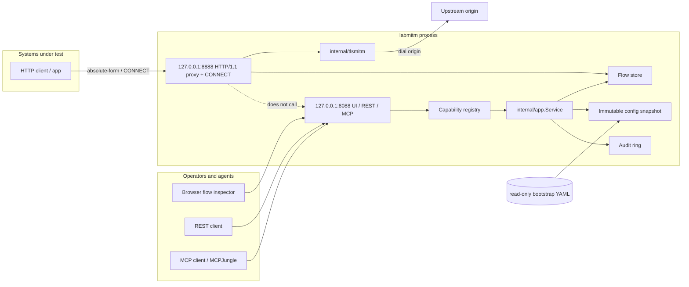

# System Architecture

Status: Proposed normative behavior
Owners: Architecture, Proxy, Control Plane
Last reviewed: 2026-09-03 (Status replaceTLS OCC merge)
Related ADRs: 0001, 0002, 0003, 0004, 0005, 0006, 0007, 0008, 0009, 0010, 0011, 0012, 0013, 0014, 0015, 0016, 0017, 0018

## Problem statement

Laboratory systems under test need a first-party **HTTP(S) intercepting forward proxy** that captures every request and response, can mint a lab CA and per-host leaves to decrypt TLS, and exposes the same authorized operations over native REST `/v1` and MCP `POST /mcp`. Off-the-shelf mitmproxy is a Python attack/research tool: it has a plugin VM, no versioned YAML desired state, no family capability registry, no REST/MCP parity, and no hardened scratch image. `mcp-integration-lab` composes LabMITM (vendor **v1.1.0** + `labmitm:local`). There is **no** predecessor mitmproxy service and **no** mitmproxy HTTP API consumer. Catalog id is **`labmitm`**.

**LabMITM** is a single-process Go lab appliance in the LabDNS / LabMail / TacLab family. Systems under test send HTTP/1.1 absolute-form requests and CONNECT tunnels to a localhost-default proxy bind. Desired state is a fail-closed `labmitm.dev/v1alpha1` YAML file. Captured flows are ephemeral: restart or reset returns the process to the mounted bootstrap and an empty flow store. TLS interception uses an in-process lab CA (generate-in-memory or load PEM files). Rewrite and breakpoint rules are deterministic and default-off. There is no Python addon VM, no public CA, and no LabDNS-style random chaos engine.

## Naming and artifacts

| Kind | Value |
|---|---|
| Product | LabMITM |
| Repository | `github.com/hilather/go-lab-mitmproxy` |
| Go module | `github.com/hilather/go-lab-mitmproxy` |
| Binary / CLI | `labmitm` |
| Image | `ghcr.io/hilather/labmitm` (`:local` for compose builds, digest-pin in GitOps) |
| Container user | `65532:65532` |
| Config schema | `labmitm.dev/v1alpha1` |
| Kind | `LabMITM` |
| Native REST | `/v1` |
| MCP | `POST /mcp` (Streamable HTTP, `Stateless: true`) |
| UI | `/` (SPA) |
| Metrics | Hand-rolled OpenMetrics; default `127.0.0.1:9090`; `/v1/metrics` only if `publicPath: true` |
| Error URN prefix | `urn:labmitm:error:` |
| MCP resource URI | `labmitm://...` |
| Default proxy bind | `127.0.0.1:8888` |
| Default management bind | `127.0.0.1:8088` |
| Healthcheck | `labmitm healthcheck --url=http://127.0.0.1:8088/v1/health/ready` |
| Session cookie | `labmitm_session` |
| CSRF header | `X-LabMITM-CSRF` |

## Port allocation

Family container-internal binds that must not collide:

| Appliance | Data plane (container) | Management (container) | Host (default profile) |
|---|---|---|---|
| LabDNS | `:5353` udp/tcp | `:8080` | `10053` / `18080` |
| LabMail | `:1025` | `:1080` | `1025` / `1080` |
| TacLab | `:49`/`:300`/`:1812`/`:1813` | `:8080` | `18049` |
| LabLDAP | `:3389`/`:3636` | `:8443` | `3389`/`3636`/`8443` |
| labinfo | — | `:8080` | `18090` |
| MCPJungle | — | `:8080` | `8080` |
| **LabMITM** | **`127.0.0.1:8888` standalone / `:8888` lab** | **`127.0.0.1:8088` standalone / `:8088` lab** | **`18888` / `18088`** |
| Metrics (all) | — | `127.0.0.1:9090` | not published |

`:8080` is taken four times. `:8888` and `:8088` are free. Standalone defaults stay loopback (D10). The lab overlay is the place that binds `:8888`/`:8088`.

## Goals (1.0)

1. Single-process Go appliance that accepts HTTP/1.1 absolute-form and CONNECT, optionally intercepts TLS with a lab CA, captures flows, and never wraps or execs Python mitmproxy.
2. Versioned, fail-closed YAML bootstrap; runtime flows ephemeral; reset rereads bootstrap and wipes the flow store.
3. Same authorized flow and state operations on REST `/v1` and MCP `POST /mcp` (parity).
4. Embedded operator flow-inspector UI (React/TS + Vite, Node **22.14.0**) that calls REST only.
5. Hardened container: non-root UID 65532, scratch/static, read-only root, `cap_drop: ALL`, no-new-privileges, tmpfs `/tmp`.
6. In-tree proxy + TLS intercept using stdlib `net/http`, `crypto/tls`, `crypto/x509` only.
7. Bounded flow store (count + bytes + per-body cap) with fail-closed `fullPolicy`.
8. Deterministic, default-off rewrite / breakpoint / delay / inject rules. No random chaos.
9. Structured errors (`urn:labmitm:error:`), audit ring, hand-rolled OpenMetrics, live/ready probes.
10. Design-pack-first repo: numbered normative docs, ADRs, generated contracts, and this PR plan land in-tree in PR 1.

## Non-goals (1.0)

- Reverse-proxy / ingress, transparent TPROXY / iptables redirect, SOCKS4/SOCKS5.
- HTTP/2 or HTTP/3 on the client-facing proxy hop, the intercepted inner connection, or the upstream origin hop.
- WebSocket **frame** inspection (1.0 forwards a `101` upgrade then copies bytes; frames are not decoded).
- mitmproxy Python addon API, mitmproxy `.py` scripts, mitmproxy REST (`/flows`, mitmweb), or any addon VM.
- Wrapping, vendoring, or exec’ing the Python `mitmproxy` binary.
- Third-party proxy libraries (`elazarl/goproxy`, `google/martian`, `projectdiscovery/martian`, etc.).
- Public / well-known CA, ACME, or shipping a CA private key in the image.
- Exploit generation, drive-by install, SSL-stripping as a product feature, or undocumented intercept.
- LabDNS-style weighted / random chaos engine.
- Durable flow-directory persistence, object stores, or databases.
- Multi-replica shared store or consensus.
- OAuth Protected Resource Metadata (family exemption: lab static bearer).
- HTTP Basic on management (no concrete compat consumer; unlike LabMail).
- Always-on data-plane `Proxy-Authorization`. Opt-in HTTP proxy 407 is D76 ([ADR 0017](https://github.com/hilather/go-lab-mitmproxy/blob/main/docs/adr/0017-http-proxy-407.md)); default-off.
- QUIC / HTTP/3, gRPC-over-h2 inspect, DTLS.
- Being a general attack framework or “burp-like” scanner.

## 1.1 opt-in (flags default off)

Additive `labmitm.dev/v1alpha1` fields enable HTTP/2 (inner+origin), SOCKS5/4 CONNECT on the proxy listener, a Linux original-destination REDIRECT listener, and optional compat flow REST. **1.1 opt-in flags default off (D22).** Orig-dest **bind** remains Reset-only. Hop-protocol and accept-mux booleans that the process already consults from the session snapshot or `liveSpec()` are live-applyable via `setFeature` (and `replaceCompat` for the compat subtree) ([ADR 0013](https://github.com/hilather/go-lab-mitmproxy/blob/main/docs/adr/0013-live-protocol-feature-gates.md) **D51'**). 1.0-preserving hop gates (`protocols.websocket` / `connect` / `absoluteForm`) default **on** at decode (D22 carve) so empty `spec: {}` hop behavior stays HTTP/1.1 + SOCKS-close + WebSocket 101. CONNECT calls the extracted `serveInterceptConn` helper. `protocols.http2` feeds Handshake NextProtos from the session snapshot (D46); when enabled and the leaf ALPN is `h2`, inner streams are captured via `roundTripInnerH2` and transcoded onto one HTTP/1.1 origin TCP (D44). The proxy accept mux peeks in a per-conn goroutine (D42) and SOCKS-closes `0x04`/`0x05` while `acceptSOCKS5`/`acceptSOCKS4` are false. When those flags are on, SOCKS5/4 CONNECT (NO AUTH) is multiplexed on `listeners.proxy` and calls `serveInterceptConn` without an HTTP 200. HTTP CONNECT still writes 200 then intercepts. Orig-dest is a separate Linux REDIRECT listener (D50). Compat flow REST is an after-auth adapter under a configurable prefix (default `/compat`).

- [ADR 0008](https://github.com/hilather/go-lab-mitmproxy/blob/main/docs/adr/0008-additive-v1alpha1-11.md): additive schema; reserved keys stay; D22 default-off for 1.1 opt-in. [ADR 0013](https://github.com/hilather/go-lab-mitmproxy/blob/main/docs/adr/0013-live-protocol-feature-gates.md) replaces D51 with **D51'** (live hop/accept vs Reset bind) and carves D22 for 1.0-preserving gates.
- [ADR 0009](https://github.com/hilather/go-lab-mitmproxy/blob/main/docs/adr/0009-http2-via-http2x.md): supersedes ADR 0002 **D8 scope only**. **D7 stands.**
- [ADR 0010](https://github.com/hilather/go-lab-mitmproxy/blob/main/docs/adr/0010-socks-and-original-destination.md): supersedes the “TPROXY/SOCKS are 1.1+” **sentence**. TPROXY stays rejected.
- [ADR 0011](https://github.com/hilather/go-lab-mitmproxy/blob/main/docs/adr/0011-optional-compat-flow-rest.md): supersedes ADR 0007 D5’s “no compat path in 1.0” **sentence**. Native `/v1` + MCP primacy stands. `/compat` is **not** on `catalog()` / `compileRoutes`.

**D7 stands.** In-tree proxy, no third-party MITM library, CONNECT Hijack. Legal YAML names are camelCase (`acceptSOCKS5`, `originalDestination`, `protocols.http2`, `compat.flowREST`). Reserved `socks*` / `tproxy` / `mitmproxy*` keys stay reserved.

## 1.2 opt-in (flags default off)

[ADR 0012](https://github.com/hilather/go-lab-mitmproxy/blob/main/docs/adr/0012-protocol-expansion-12.md) records **D58–D68**. Client-facing h2c, SOCKS BIND / UDP ASSOCIATE, SOCKS username/password, Extended CONNECT websocket, origin `h2`, `PUSH_PROMISE` capture, gRPC decode, and WebSocket frame inspect are 1.2-class, default-off, **Reset-only** (D51' remainder; live apply of 1.2 flags needs a new ADR). Empty spec remains 1.0. Overlay YAML stays flags-off. Nested inner CONNECT without `:protocol` still RST (**no flow**). HTTP hop `Proxy-Authorization` is default-off (D76 / [ADR 0017](https://github.com/hilather/go-lab-mitmproxy/blob/main/docs/adr/0017-http-proxy-407.md)); empty `spec: {}` stays an unauthenticated HTTP hop. GSSAPI remains a non-goal. **D7 stands.**

## Key decisions

These are closed. Implementers do not re-litigate them without an ADR.

| ID | Decision | Rationale |
|---|---|---|
| **D1** | **Product name is LabMITM.** Repo remains `go-lab-mitmproxy`. Module `github.com/hilather/go-lab-mitmproxy`. Binary / CLI `labmitm`. Image `ghcr.io/hilather/labmitm`. YAML `apiVersion: labmitm.dev/v1alpha1`, `kind: LabMITM`. | LabMail naming rule. TacLab is the frozen exception (TacLab ADR 0018, cross-repo). |
| **D2** | **Single process, two planes.** Proxy data plane is independent of management HTTP. Invalid bootstrap does **not** bind either listener. | LabDNS / LabMail process model. |
| **D3** | **Desired state is YAML; the flow store is not.** Reset reloads YAML **and** wipes flows. | Family GitOps invariant. |
| **D4** | **REST and MCP share one capability registry.** Adapters never call each other. | LabDNS / LabMail ADR 0004. |
| **D5** | **Native management API is `/v1` + `POST /mcp` only.** No mitmproxy REST, no mitmweb, no Python addon protocol. | Zero mitmproxy API clients in the lab. |
| **D6** | **Auth: lab static bearer is primary. No HTTP Basic in 1.0.** | No Basic consumer. Tokens ≥256 bits, file refs only. |
| **D7** | **In-tree HTTP/1.1 forward proxy.** No third-party proxy library. CONNECT **must** Hijack (D19). | Family owns protocol state machines. |
| **D8** | **HTTP/1.1 only on every hop in 1.0.** HTTP/2 preface is a hard close. | Intercepting h2 requires a frame codec the family does not own. |
| **D9** | **TLS intercept is in-process lab CA + per-host leaf minting.** `generate` or `files`. Never ship a public CA. Never log the CA private key. | Lab-only intercepting proxy. |
| **D10** | **Default proxy bind is `127.0.0.1:8888`. Default management bind is `127.0.0.1:8088`.** Explicit LabMail deviation (LabMail defaults are all-interfaces). | An intercepting proxy is an open-proxy loaded gun. |
| **D11** | **Store is memory-first with stacked caps.** Default `fullPolicy: reject`. Store-full **still forwards**. | Prevents OOM. Capture is best-effort. |
| **D12** | **No chaos engine in 1.0.** `spec.rules` is deterministic, default-off, first-match-wins. | A capture appliance’s job is explainable behavior. |
| **D13** | **Embedded flow-inspector UI ships in 1.0.** React + TypeScript + Vite, Node **22.14.0**. Frozen table: [Embedded operator UI](#embedded-operator-ui). | Family replacement contract. GA is not done without PR 13. |
| **D14** | **Go 1.26, official MCP SDK `v1.7.0`, protocol `2026-07-28`, Apache-2.0.** `KnownFields(true)`. CI pin `GO_VERSION=1.26.6`. | Family pins. |
| **D15** | **`allowLegacyClients` default false; lab overlay sets true.** `subscriptions/listen` stays 2026-07-28. | So MCPJungle can register without a LabMITM patch. |
| **D16** | **Data-plane Dial is required, isolated, and resolve-then-guard.** Dial only in `internal/proxy`. | Hostname-only guards miss CNAME→IMDS. |
| **D17** | **Proxy HTTP hop is unauthenticated by default.** No always-on `Proxy-Authorization`. 1.2 supersedes the unauthenticated-data-plane sentence **for SOCKS only** ([ADR 0012](https://github.com/hilather/go-lab-mitmproxy/blob/main/docs/adr/0012-protocol-expansion-12.md) D60): opt-in file-ref username/password; GSSAPI out; management still bearer (D6). [ADR 0017](https://github.com/hilather/go-lab-mitmproxy/blob/main/docs/adr/0017-http-proxy-407.md) **D76** supersedes the HTTP remainder **only when `spec.proxy.httpAuth.enabled` is true**. Empty `spec: {}` stays today's unauthenticated HTTP hop. | Lab clients (`curl --proxy`) must keep working. Binding localhost is the 1.0 access control. SOCKS user-pass and HTTP 407 are separate lab-static planes, default-off, fail-closed. |
| **D76** | **Opt-in HTTP proxy 407 on `listeners.proxy` only.** Schema `spec.proxy.httpAuth` (default `enabled: false`). Live apply verb `replaceHTTPAuth` (8th `KnownOp`). File-ref users → snapshot `HTTPAuthUsers`. Basic only. Management stays bearer (D6). Catalog stays 31; `features.get` stays 11. Compact `status.features.httpAuth` is additive (K10 reopen). Orig-dest, inner intercept, SOCKS, Replay, h2c Extended CONNECT: out. | QA corp-proxy auth simulation. `setFeature` is boolean-only; `replaceRules` cannot 407 CONNECT and must not 407 inner hops. ADR 0014 / D69 is QA block modes. ADR 0015 / D72–D74 is WebSocket frame rules. |
| **D77** | **Status may apply `ui.enabled` via existing `setFeature` after a gated off-confirm.** Turning off 404s all inspector routes (`/`, `/status`, `/flows/…`); REST/MCP stay up. Recovery is REST/MCP `setFeature ui.enabled: true` or bootstrap YAML + Reset. Apply mode stays live. Reset-only IDs stay Reset-only. HTTP 407 stays `replaceHTTPAuth`, not a Features-table switch. | [ADR 0018](https://github.com/hilather/go-lab-mitmproxy/blob/main/docs/adr/0018-status-ui-enabled-apply.md). ADR 0013 closed call #3 reconsideration. |
| **D18** | **Catalog id is `labmitm`.** Lab pin is vendor tag **v1.1.0** + `labmitm:local` (not a GHCR digest). | No predecessor to preserve. |
| **D19** | **CONNECT Hijack + inner HTTP/1.1 session.** Never return that conn to `http.Server`. | Returning after 200 makes keep-alive parse the TLS ClientHello as a request. |
| **D20** | **`intercept: true` does not silently tunnel.** Handshake failure closes both sides. | Silent fallback would hide a failed MITM. |
| **D21** | **`Transport.RoundTrip` only; no `http.Client`.** Replay Dials the origin, ignores `HTTP_PROXY`, never hairpins. | `Client.Do` follows redirects and would merge hops. |
| **D69** | **QA block modes extend `action.type`:** `silent`, `hang`, and `redirect` (not a parallel engine). | [ADR 0014](https://github.com/hilather/go-lab-mitmproxy/blob/main/docs/adr/0014-qa-block-modes.md) |
| **D72** | **`phase: websocket` matches inspected frames after HTTP/1.1 `101` or inner D63 `:status=200`.** Response-phase hits on those statuses stay `late_skip`. h2c has no request/response `matchHit`. | [ADR 0015](https://github.com/hilather/go-lab-mitmproxy/blob/main/docs/adr/0015-websocket-frame-rules.md) |
| **D73** | **Websocket-phase `drop` omits one frame; `block` closes both TCP sides.** `labmitm_ws_frames_total` counts forwarded frames only. | ADR 0015 |
| **D74** | **`inspectFrames` stays Reset-only (D51').** Live path is `replaceRules` / `setFeature rules.enabled` on the STA-001 pin (next request / next CONNECT / next h2c PRI; open inspect sockets never reload). Catalog stays 31. | ADR 0015 |
| **D75** | **Rules may include `action.type: throttle`.** The winning item paces that phase’s **body** at `bytesPerSecond` (256 B/s–64 MiB/s). Live `replaceRules`. No daemon, no jitter, no new capability. See [ADR 0016](https://github.com/hilather/go-lab-mitmproxy/blob/main/docs/adr/0016-rules-throttle-action.md). | Issue #52 QA bandwidth without collapsing into `delay`. ADR 0015 is websocket frame rules (D72–D74); ADR 0017 / D76 is HTTP proxy 407. |

## Process architecture

One `labmitm` process. Invalid bootstrap does **not** bind proxy or management.



```text
HTTP/1.1 proxy wire
  -> admission (conns, rate, size, target guards)
  -> request parse (absolute-form | CONNECT)
  -> rules (request phase)
  -> optional TLS intercept (internal/tlsmitm)
  -> upstream dial + HTTP/1.1 exchange
  -> rules (response phase)
  -> store.Insert (capped bodies)
  -> metrics + optional audit "flow.captured"

REST adapter ----+
MCP adapter -----+--> capabilities registry --> app.Service
UI (static) -----> REST only                    -> store / snapshot / audit / rules
```

**Invariant:** `internal/proxy` and `internal/tlsmitm` must not import `internal/control` (including `internal/control/mcp` and `internal/control/rest`) or `internal/web`. Management failure must not stop the proxy. The proxy must not block on MCP clients.

## Embedded operator UI

Required for GA / 1.0 (D13, PR 13). The UI talks REST only. XSS/CSP: [docs/08-rest-api.md](https://github.com/hilather/go-lab-mitmproxy/blob/main/docs/08-rest-api.md) and [docs/10-security-architecture.md](https://github.com/hilather/go-lab-mitmproxy/blob/main/docs/10-security-architecture.md).

| Item | Choice |
|---|---|
| Stack | React + TypeScript + Vite (Node 22.14.0), LabMail/TacLab pattern |
| Embed | `internal/web` `go:embed` of `web/dist` (copy step; `web/` has its own `go.mod` so parent `go test ./...` does not walk `node_modules`) |
| Auth | Login page: paste bearer. `POST /v1/session`. Cookie `labmitm_session` + `X-LabMITM-CSRF`. Cookie is REST-only. No Basic form. |
| Pages | Flows split-pane (list stays mounted; selection on `/` + `/flows/:id` drives Request / Response / TLS; Trailers / Frames / gRPC when present). Intercept vs tunnel-not-decrypt chips. Completed raw CONNECT is a tunnel summary (`why not decrypted: port not in tls.ports:[443]`), not empty HTTP panes. Handshake `tls_handshake` / `http2_inner` stays an error, not that chip. Header chrome: LabMITM, **live**, intercept-ports chip from live `GET /v1/state` `canonical.spec.tls.ports` (e.g. `:443 intercept` / `:8443 intercept`; never hardcoded `:443 intercept only`). Status / Audit / Reset / Login page bodies share the same dark lab chrome (IBM Plex, `#0b0c0e` / `#6ea8d1` / `#c4a35a`); tunnel-not-decrypt remains a **flow** chip only. CA download (`GET /v1/ca`; `ca.spkiSha256` on status), status (11-row feature catalog from `GET /v1/features`; `mitm.admin` live `setFeature` including gated `ui.enabled` off-confirm; compact `status.features` including `httpAuth` + Reset-required 1.2 flags as muted text; live `replaceTLS` (hidden `hosts`/`ca`/`upstream` from the OCC `GET /v1/state` snapshot) / `replaceHTTPAuth` / `replaceRules` / `replaceAdmission` / `replaceCompat`; reset-only catalog row links to `/reset`; no `/features` route), Frames tab badges `drop`/`block`, audit (if scoped), gated reset |
| Live update | `EventSource` `GET /v1/events/stream` (SSE) stays mounted while selecting flows (`flow.inserted` / `flow.paused` / `flow.deleted` / `store.wiped`). Fallback: 3s poll of `GET /v1/flows`. |
| Bodies | Render as text if `Content-Type` is text/*, json, xml, form; otherwise hex/size + download. Never `innerHTML` of response HTML. Download is `download=` plus blob fetch; raw body GETs are `application/octet-stream` + attachment. Optional iframe preview **only** with `sandbox` (no scripts, no same-origin) and CSP `default-src 'none'` — default **off**. |
| Missing on purpose | Fuzzer, repeater-as-weapon, payload generator, “exploit”, SSL-strip toggle, Relay |

`spec.ui.enabled: false` serves 404 for `/` (and `/status`, `/flows/…`) but keeps REST/MCP. Status may apply that bit after a gated off-confirm ([ADR 0018](https://github.com/hilather/go-lab-mitmproxy/blob/main/docs/adr/0018-status-ui-enabled-apply.md) D77).

## Package layout

```text
.
|-- AGENTS.md
|-- README.md
|-- START-HERE.md
|-- LICENSE                          # Apache-2.0
|-- CHANGELOG.md
|-- Makefile
|-- go.mod                           # github.com/hilather/go-lab-mitmproxy
|-- Dockerfile
|-- cmd/labmitm/                     # process entrypoint only
|-- internal/
|   |-- model/                       # Spec, Flow, Message, Operation, Rule
|   |-- config/                      # decode, KnownFields, normalize, validate, hash, export
|   |-- compiler/                    # spec → snapshot (rules index, CA handle, caps)
|   |-- snapshot/                    # atomic config snapshot
|   |-- store/                       # flow inbox
|   |-- proxy/                       # HTTP/1.1 forward proxy listener + session
|   |-- tlsmitm/                     # lab CA, leaf mint, dual TLS
|   |-- httputilx/                   # hop-by-hop strip, header fold; NOT httputil.ReverseProxy
|   |-- rules/                       # first-match evaluate (compiler snapshot is STA-001)
|   |-- app/                         # Service (no HTTP/MCP types)
|   |-- capabilities/                # registry
|   |-- control/rest/
|   |-- control/mcp/
|   |-- auth/
|   |-- audit/
|   |-- domainerr/
|   |-- observability/
|   |-- buildinfo/
|   |-- web/                         # embed SPA
|   `-- proxytest/                   # test client; *_test.go only
|-- api/
|-- web/
|-- docs/
|-- examples/
|-- testdata/
|-- scripts/{generate,checkdocs,checkchangelog,test-container.sh}
`-- tasks/
```

`cmd/labmitm` contains no protocol or store logic.

## Allowed third-party direct deps at 1.0

| Module | Why |
|---|---|
| `gopkg.in/yaml.v3` | Family config |
| `github.com/modelcontextprotocol/go-sdk v1.7.0` | Family MCP |
| `github.com/oklog/ulid/v2` | Crockford ULID flow ids (MIT; LabMail pin) |

1.1 codec (ADR 0009 / D28): `golang.org/x/net/http2` behind `internal/http2x` only (BSD-3, Apache-2.0 compatible). Not a proxy/MITM library. Dial idents forbidden; `DialTLS` stays nil.

No Prometheus client (`github.com/prometheus/*` forbidden). Metrics are hand-rolled OpenMetrics in `internal/observability`. No proxy/MITM frameworks. Prefer `net/http`, `log/slog`, `crypto/tls`, `crypto/x509`, `crypto/ecdsa`. New deps need a PR justification and Apache-2.0-compatible license check.

## Canonical data model

Canonical Go types in `internal/model` (implemented in CFG-001 / STORE-001):

```go
type Spec struct {
    Listeners     ListenersSpec
    Proxy         ProxySpec
    TLS           TLSSpec
    Rules         RulesSpec
    Store         StoreSpec
    UI            UISpec
    Management    ManagementSpec
    Observability ObservabilitySpec
}

type Flow struct {
    ID           string
    StartedAt    time.Time
    CompletedAt  time.Time
    State        string // open | paused | completed | dropped | error
    PausedPhase  string // request | response | ""
    ClientAddr   string
    Method       string
    URL          string
    Host         string
    Scheme       string // http | https
    Protocol     string // http/1.1 | websocket | connect
    Status       int
    Error        string
    Intercepted  bool
    Request      HTTPMessage
    Response     HTTPMessage
    TLS          *TLSInfo
    Timings      Timings
    RuleIDs      []string
    Truncated    bool
}
```

## CLI

```text
labmitm serve --config=/etc/labmitm/config.yaml
              [--proxy-listen ADDR] [--management-listen ADDR|off]
              [--shutdown-timeout 5s] [--pid-file /tmp/labmitm.pid]
labmitm validate --config=...
labmitm canonicalize --config=... [--format yaml|json]
labmitm healthcheck --url=http://127.0.0.1:8088/v1/health/ready
labmitm mcp-stdio --config=... --token-file=...
labmitm version
labmitm help
```

There is **no** `serve --token-file`. `labmitm send` / `labmitm request` are **not** shipped.

TLS-001 implements `serve` with optional HTTPS intercept (`tls.intercept: true`, default ports `{443}`). API-001 binds management REST when `--management-listen` is an address **and** `management.auth.mode: bearer` has ≥1 usable token. Missing token files fail serve. `--management-listen=off` leaves management unbound. OBS-001 implements `labmitm healthcheck` and the `127.0.0.1:9090` scrape listener.

## Invariants

1. Proxy request handling does not depend on REST or MCP availability.
2. Invalid bootstrap does not bind proxy or management.
3. REST and MCP call the same application capabilities.
4. Bootstrap YAML is read-only to the service.
5. Unknown configuration fields are errors.
6. Dial is isolated to `internal/proxy`.
7. Runtime flows are ephemeral and do not set `drifted`.
8. `internal/proxy` and `internal/tlsmitm` do not import management packages.
9. CONNECT is Hijacked and never returned to `http.Server`.
10. Intercept handshake failure does not fall back to a blind tunnel.

## Residual limitations

See [docs/known-limitations.md](https://github.com/hilather/go-lab-mitmproxy/blob/main/docs/known-limitations.md). 1.0 defaults remain the process defaults. 1.1 opt-in flags default off (D22); 1.0-preserving hop gates default on (D22 carve). 1.2 flags are default-off, Reset-only (D51'). Overlay YAML stays flags-off. Catalog is 31 `/v1` rows including `features.get`. **D7 stands.**

- HTTP/3 / QUIC still out. No `h3` ALPN, no datagrams. HTTP/2 inner is `protocols.http2.enabled` (default off). Client-facing h2c is `protocols.http2.clientCleartext` (default off, Reset-only); flag-off `PRI` is still a hard close.
- GSSAPI (SOCKS method `0x01`) is never selected.
- Nested inner CONNECT without `:protocol` still RST, **no flow** (D48 remainder). Illegal h2 `Upgrade: websocket` still RST, no flow.
- grpc-web stays opaque (content-type recorded; payload not parsed).
- Unspecified BIND DST (`0.0.0.0:0` / `[::]:0`) is rejected (no Listen).
- No TPROXY in the appliance (`tproxy` reserved). No reverse-proxy. UDP ASSOCIATE is not orig-dest transparent UDP.
- Empty `spec: {}` is still a 1.0 process. 1.1 `acceptSOCKS5` remains CONNECT-only unless `acceptBind` / `acceptUDPAssociate` / `acceptUserPass`.
- No Python VM, mitmweb, dumpfile, CLI-flag clone, or wrapping Python mitmproxy.
- Orig-dest is Linux-only REDIRECT + `SO_ORIGINAL_DST`, default off. Supported topologies are shared-netns + sidecar iptables or host-network REDIRECT (D50). Publishing `8890` is not transparent.
- Compat flow REST is a mitmproxy-inspired **subset** (default off, live `setFeature` / `replaceCompat`). Not mitmproxy 11 compatible. Prefix collision stays `validation_failed`. `/compat` is **not** on `catalog()`.
- SOCKS5/4 CONNECT is opt-in. BIND, UDP ASSOCIATE, and username/password require their own 1.2 flags. GSSAPI is never selected.
- 1.1 hop/accept flags the running proxy already honors (`acceptSOCKS5`/`acceptSOCKS4`, `protocols.http2.enabled`, `protocols.websocket` / `connect` / `absoluteForm`, `compat.flowREST`, `rules.enabled`, `ui.enabled`) are live-applyable via `setFeature` / `replaceCompat` (D51') without Reset or wiping flows. Disabled hop gates 403 `forbidden` before rules/Dial. Orig-dest **bind** + listener **addresses** + management TLS files + `metrics.listen` stay Reset-only. 1.2 nested flags (`acceptBind`/`acceptUDPAssociate`/`acceptUserPass`, `protocols.http2.clientCleartext`/`origin`/`extendedConnect`/`capturePush`/`grpcDecode`, `protocols.websocket.inspectFrames`) stay Reset-only. `features.get` lists the 11-row catalog on `GET /v1/features`, `mitm_features_list`, and `labmitm://features` ([ADR 0013](https://github.com/hilather/go-lab-mitmproxy/blob/main/docs/adr/0013-live-protocol-feature-gates.md)). Compact `status.features` spec-flag booleans stay on `status.get` (including additive `httpAuth`, [ADR 0017](https://github.com/hilather/go-lab-mitmproxy/blob/main/docs/adr/0017-http-proxy-407.md)).
- WebSocket frames: flag-off is 101 + bidirectional copy; flag-on `protocols.websocket.inspectFrames` (Reset-only, D67). Inner and client-facing RFC 8441 `:protocol=websocket` is opt-in `protocols.http2.extendedConnect` (D63); nested inner CONNECT without `:protocol` still RST, **no flow**. Client-facing h2c CONNECT (RFC 9113 §8.5) is on when `clientCleartext` is on (D62).
- gRPC protobuf decode: flag-off is HTTP/2 headers + DATA only; flag-on `protocols.http2.grpcDecode` (Reset-only, D66) is an in-tree length-prefix + wire tree. **grpc-web stays opaque.**
- Generate-mode CA rotates on every restart/reset.
- Store-full still forwards (capture dropped).
- Single replica; no shared flow store.
- MCP clients requiring OAuth PRM cannot authorize. MCPJungle needs `allowLegacyClients: true`.
- Proxy data plane unauthenticated by default; publishing `:8888` on a LAN is an operator choice. Opt-in HTTP 407 (D76) is not a published-bind license.
- No HTTP Basic on management (D6). Data-plane `Proxy-Authorization` is default-off (`spec.proxy.httpAuth`).
- HTML preview of captured pages is escaped text.
- Intercept **breaks origin mTLS and certificate pinning**.
- Default metadata CIDRs are AWS/GCP IPv4 + AWS IPv6 IMDS. Alibaba `100.100.100.200/32` and RFC1918 are **not** default-deny.
- Not a general attack tool.
- Worst-case RSS ≈ 256 + 64 + 4 + 64 = **388 MiB**.
- Default soak in CI is 8 flows; local lab target is 100 flows/s for 30s. Absolute QPS is not a CI gate.
- Overlay examples live in this repo. Lab pin is vendor tag **v1.1.0** + `labmitm:local` (not a GHCR digest). Catalog id is **`labmitm`** (D18).

## Related documents

- Proxy semantics: [docs/02-proxy-semantics.md](https://github.com/hilather/go-lab-mitmproxy/blob/main/docs/02-proxy-semantics.md)
- TLS: [docs/03-tls-interception.md](https://github.com/hilather/go-lab-mitmproxy/blob/main/docs/03-tls-interception.md)
- Store: [docs/04-flow-store.md](https://github.com/hilather/go-lab-mitmproxy/blob/main/docs/04-flow-store.md)
- YAML: [docs/06-state-and-configuration.md](https://github.com/hilather/go-lab-mitmproxy/blob/main/docs/06-state-and-configuration.md)
- Capability table: [docs/07-control-plane-and-parity.md](https://github.com/hilather/go-lab-mitmproxy/blob/main/docs/07-control-plane-and-parity.md)
